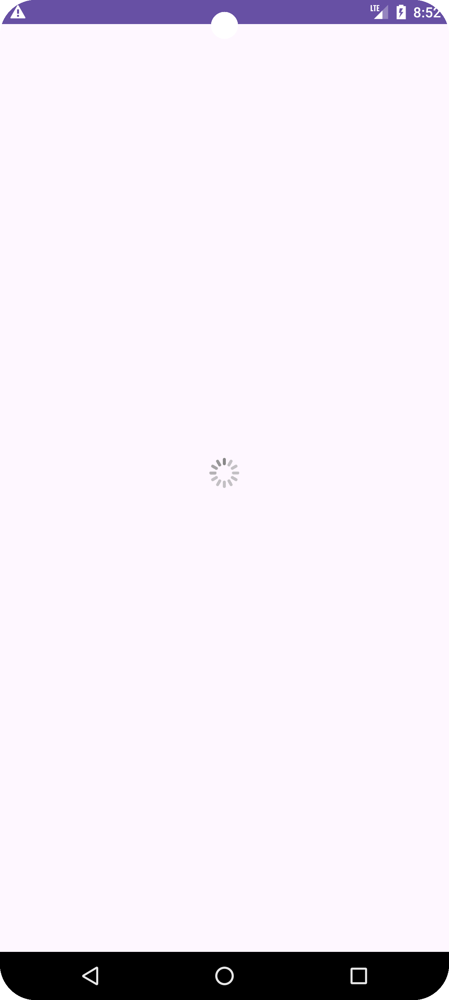

# iOS Loading for Android OS




<h1>To get a library into your project:</h1>
 <p>Step 1. Add the JitPack repository to your build file </p>


### Gradle Groovy Example

```groovy
 dependencyResolutionManagement {
		repositoriesMode.set(RepositoriesMode.FAIL_ON_PROJECT_REPOS)
		repositories {
			mavenCentral()
			maven { url 'https://jitpack.io' }
		}
	}
```
<p>Step 2. Add the dependency</p>

### Gradle Groovy Example

```groovy
dependencies {
          implementation 'com.github.diyorbekhamidov:ios_loading_indicator:1.0.5'
	}
```

<h1>How to use?</h1>
<p>Add the xml code to your layout file</p>

```xml
<com.bounce.iosloading.IosLoadingView
        android:id="@+id/progress"
        android:layout_width="wrap_content"
        android:layout_height="wrap_content" />

```


